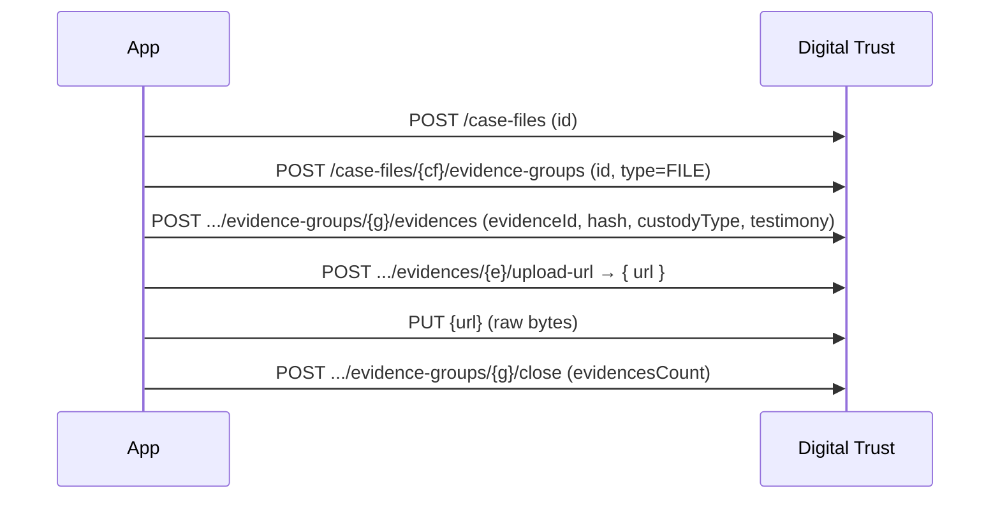
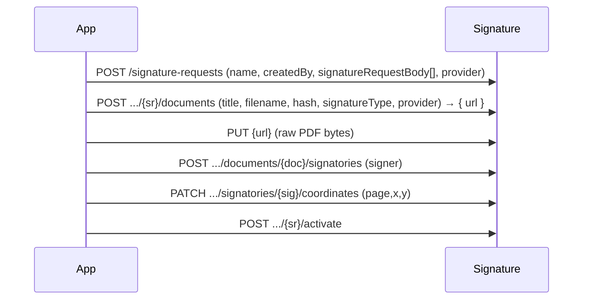

# EAD Factory — API Integration Guide

EAD Factory (a.k.a. GCloud Factory / RPaaS) is **not** one API but a platform of **four independent managers**, each with its own OpenAPI contract, its own base URL, and its own operation set. They share auth, URL conventions, and the case-file concept, but you integrate against each manager separately.

Each manager is reached at `{host}/{manager-prefix}`, then `/api/v1/private/...`. The host is environment- and tenant-specific (a production host and an `int` integration host exist); the **manager path prefix** is stable:

| Manager | Purpose | Path prefix | Swagger |
|---|---|---|---|
| Evidence (Digital Trust) | Capture & timestamp evidence, case files, reports | `/digital-trust` | `/swagger/digital-trust-api-1.0.yml` |
| Signature | E-signature requests, documents, signatories | `/signature-manager` | `/swagger/signature-manager-1.0.yml` |
| Notification | Multi-channel certified delivery | `/notifications` | `/swagger/notifications-api-1.0.yml` |
| Chat | Bot/chat certification | `/chat-manager` | `/swagger/chat-manager-bot-api-1.0.yml` |

So an evidence call on the integration host looks like `https://api.int.gcloudfactory.com/digital-trust/api/v1/private/case-files`. Use the host your tenant was issued. All four are OpenAPI 3.0.1 — fetch the live YAML from `{host}/swagger/...` for exact field schemas; this guide gives you the flows, options, and traps the raw spec doesn't spell out.

---

## 1. Authentication — OAuth 2.0 client credentials

EAD Factory has no `/session` endpoint of its own. Instead, a service integration authenticates against an **external OAuth 2.0 identity provider** (the tenant's authorization server — e.g. an Okta org) using the **client-credentials** grant, then presents the resulting bearer token to every manager:

```bash
curl -s -X POST "$TOKEN_URL" \
  -H "Content-Type: application/x-www-form-urlencoded" \
  -d grant_type=client_credentials \
  -d client_id="$CLIENT_ID" \
  -d client_secret="$CLIENT_SECRET" \
  -d scope="$SCOPE"
# → { "access_token": "...", "token_type": "Bearer", "expires_in": 3600, "scope": "..." }
```

Then send `Authorization: Bearer <access_token>` on every call. The same token works across all four managers. Tokens are short-lived (`expires_in` seconds — 3600 in the reference tenant); cache and refresh before expiry. `TOKEN_URL`, `CLIENT_ID`, `CLIENT_SECRET`, and `SCOPE` are provisioned to your integration by the platform.

> ✅ **Tested** (int environment, 2026-07-02): the grant above returns a `Bearer` token with `token_type: "Bearer"`, `expires_in: 3600`; `GET /digital-trust/api/v1/private/case-files?page=0&size=1` with that token returns `HTTP 200` and a body shaped `{ "_metadata": {...}, "records": [...] }`.

```bash
# tested: obtain a token, then a read-only list
TOKEN=$(curl -s -X POST "$TOKEN_URL" -H "Content-Type: application/x-www-form-urlencoded" \
  -d grant_type=client_credentials -d client_id="$CLIENT_ID" \
  -d client_secret="$CLIENT_SECRET" -d scope="$SCOPE" | jq -r .access_token)

curl -s "$HOST/digital-trust/api/v1/private/case-files?page=0&size=1" \
  -H "Authorization: Bearer $TOKEN"        # → 200 { "_metadata": {...}, "records": [...] }
```

---

## 2. Shared conventions

Everything below applies to all four managers.

- **URL prefix:** every private endpoint is under `/api/v1/private/...`. (Webhooks and a few callbacks live under `/api/v1/public/...`.)
- **Client-supplied UUIDs = idempotency.** Creates take an `id` / `evidenceId` / etc. that *you* generate as a v4 UUID (`crypto.randomUUID()`). Reusing the same id makes a retry idempotent. Hashes must be lowercase hex sha-256 (`^[a-f0-9]{64}$`).
- **hash → upload-url → PUT bytes.** You never post raw file bytes to the JSON API. Register metadata (with the sha-256 `hash`), receive a short-lived presigned upload URL, then `PUT` the bytes to it (plain HTTPS, no auth header). Same pattern for evidences, signature documents, and notification attachments.
- **`createdBy` / `owner`.** Many creates carry a free-text `createdBy`/`owner` — this is *your* actor label for the audit trail, not an auth field.
- **Bulk deletes** exist per manager under `/api/v1/private/bulk/...`.

Most workflows start from a **Case File** (`caseFileId`):
```
POST /api/v1/private/case-files
     { "id":<uuid>, "title"?, "code"?, "category"?, "owner"?, "description"?, "metadata"? }
```
Only `id` is strictly required.

---

## 3. Evidence capture (Digital Trust manager)

Evidence lives in a typed **group** under a case file. Register each evidence with its hash + testimony, upload the bytes, then close the group.



```
1. POST /api/v1/private/case-files/{caseFileId}/evidence-groups
      { "id":<uuid>, "type":"FILE", "name"?, "code"?, "description"?, "createdBy"?, "metadata"? }
2. POST /api/v1/private/case-files/{caseFileId}/evidence-groups/{evidenceGroupId}/evidences
      { "evidenceId":<uuid>, "hash":"<sha256>", "custodyType":"EXTERNAL",
        "capturedAt":<iso>, "title"?, "type":"image/jpeg"?, "fileName"?, "fileSize"?,
        "testimony":..., "requiredTestimonyProviders":... }
3. POST /api/v1/private/case-files/{caseFileId}/evidence-groups/{evidenceGroupId}/evidences/{evidenceId}/upload-url
      → { "url", "expiration" }
4. PUT <url>   (raw bytes)
5. POST /api/v1/private/case-files/{caseFileId}/evidence-groups/{evidenceGroupId}/close
      { "evidencesCount":<n>, ...device/location? }
```

| Option | Field | Values |
|---|---|---|
| Group type | `type` | `FILE`, `PHOTO`, `VIDEO`, `WEB_PLUGIN` |
| Custody | `custodyType` | `INTERNAL` (platform hosts the file) · `EXTERNAL` (you hold it) |

- `capturedAt`, `custodyType`, `hash`, `evidenceId`, `testimony`, `requiredTestimonyProviders` are **required** when registering an evidence.
- Case-file-free evidence is also possible via the top-level `POST /api/v1/private/evidences`.
- ⚠️ **Tenant context (write flows).** The write bodies above are spec-derived; a raw `POST /case-files` against the `int` host returned `HTTP 500` from a server-side `ValidationErrorFormatter` (it fails while formatting an underlying validation error). The likely cause is missing tenant context: the reference client sets an **`X-Tenant-Id`** header for local/non-prod calls. Supply your tenant id (and `X-Correlation-Id` if you trace requests) when the token alone doesn't carry the tenant. Verify the exact header against your environment before relying on these creates. *(Auth + read are tested above; the write chain is not yet confirmed end-to-end on int.)*
- Like GoCertius, the presigned upload almost certainly expects an S3 checksum header — if a plain `PUT` to the returned URL gives `403 SignatureDoesNotMatch`, add `x-amz-checksum-sha256: <base64 sha-256>` (see the gocertius-suite-api skill for the tested pattern).
- **Reports:** generate an evidential report with `POST /case-files/{caseFileId}/reports`, preview via `.../report-preview`, then fetch `.../reports/{reportId}/document` and `.../package`.
- **Single-file sign/timestamp:** `POST /api/v1/private/sign-file` then `.../sign-file/{fileId}/download-url` for a one-shot signed/timestamped file without the full case-file flow.

---

## 4. E-signature (Signature manager)

Signature type is chosen **per document**, not per request — one request can mix levels. Build the request and its signers, add documents (each with its `signatureType`), upload bytes, place signatures, then activate.



```
1. POST /api/v1/private/signature-requests
      { "name", "createdBy", "language"?, "provider":"EADTRUST",
        "signatureRequestBody":[ ...signers/config... ],
        "notifications"?, "uniqueValidator"?, "closeConfig"?, "webhookUris"?,
        "senderName"?, "senderAddress"? }
2. POST /api/v1/private/signature-requests/{signatureRequestId}/documents
      { "title", "filename", "hash":"<sha256>", "signatureType":"ADVANCED",
        "provider":"EADTRUST", "convertToPdf"?, "detached"?, "sequence"?,
        "fileSize"?, "signatureDeadline"?, "evidenceId"?, "metadata"? }
      → { "id", "url", "expiration" }
3. PUT <url>   (raw PDF bytes)
4. POST .../signature-requests/{sr}/documents/{documentId}/signatories   (add each signer)
5. PATCH .../signature-requests/{sr}/documents/{documentId}/signatories/{signatoryId}/coordinates
      { "coordinates":[ { "page":1, "x":30, "y":230 } ] }
6. POST /api/v1/private/signature-requests/{signatureRequestId}/activate
```

| Option | Field | Values | Notes |
|---|---|---|---|
| Signature level | `signatureType` (per document) | `ADVANCED` · `INTERPOSITION` · `OTHER` | `ADVANCED` = advanced e-signature; `INTERPOSITION` = platform-interposed delivery; set per document. |
| Provider | `provider` | `EADTRUST` | The signing/trust-service provider. |
| Validators | `uniqueValidator`, `.../signatories/{id}/validators` | — | Add validators who must approve a signatory before they sign. |
| Signing order | per-document/signatory `sequence` | integer | Order documents/signatories via the `.../sequence` PATCH endpoints. |

**Gotchas**
- **Coordinates before activation** — every signatory needs at least one `{page,x,y}`; note it is a **`PATCH`** here (GoCertius uses `PUT`).
- **`signatoryId`** comes from the document's signatories collection (`GET .../documents/{documentId}/signatories`), not from the create response.
- Legal-entity signers have their own sub-resource (`.../documents/{documentId}/legal-entity-signers`).
- Manage a live request with `.../cancel`, `.../close`, per-signatory `.../resend`; fetch outputs via `.../documents/{documentId}/links/signed/download` and `.../reports/...`.

---

## 5. Certified notification (Notification manager)

Multi-channel certified delivery. Create the request, add channel-typed receivers, attach documents (upload), then activate.

```
1. POST /api/v1/private/notifications  (or /notifications/v2 → registerNotification)
      { ...subject/content/config... }                         → { requestId }
2. POST /api/v1/private/notifications/requests/{requestId}/receivers
      { "receivers":[ { ...channel-specific... } ] }           (min 1)
3. POST /api/v1/private/notifications/requests/{requestId}/attachments
      { "attachments":[ { ...hash/fileName... } ] }            → { uploadLinks[] }
   PUT <uploadLink>   (raw bytes)
4. POST /api/v1/private/notifications/requests/{requestId}/activate
```

| Aspect | Where | Values |
|---|---|---|
| Delivery channel | receiver model type | `SMTP` (email) · `SMS` · `WFB` (WhatsApp for Business) · `NOTICEMAN` |
| Delivery state (read) | notification status | `DELIVERING` `SENT` `OPEN` `READ` `ANSWERED` `ERROR` `RELAY` `BOUNCE` |

- Each channel has its own receiver body (`AddReceiverEmailNotificationRequestModel`, `...Sms...`, `...Wfb...`, `...Noticeman...`) — check the swagger for per-channel fields (phone format, sender, etc.).
- Manage a sent notification with `.../{notificationId}/cancel`, `.../clone`, `.../resend`.
- Reports/certificates: `POST /api/v1/private/reports`, then `.../reports/{reportId}/file` and `.../package`.
- Attachment download links: `.../requests/{requestId}/attachments/{attachmentId}/download-url`.

---

## 6. Chat certification (Chat manager)

The chat-manager-bot API certifies bot/chat conversations. It follows the same `/api/v1/private` + client-UUID + report conventions. Consult `/swagger/chat-manager-bot-api-1.0.yml` for its operation set (chats, messages, certificates) when you need it.

---

## 7. Quick reference

**Auth:** OAuth 2.0 client-credentials grant against the tenant IdP → `Authorization: Bearer <token>`, same token across all managers; tokens expire (~1 h), refresh before expiry.

**Base URL:** `{host}/{manager-prefix}/api/v1/private/...` — prefixes `/digital-trust`, `/signature-manager`, `/notifications`, `/chat-manager`; host is tenant/environment-specific.

**Global patterns:** client v4 UUIDs for idempotency · lowercase-hex sha-256 hashes · hash → upload-url → PUT bytes · build-then-activate for signature & notification · list responses shaped `{ _metadata, records }`.

**Enum cheat-sheet:**
- Evidence group type: `FILE` `PHOTO` `VIDEO` `WEB_PLUGIN` · Custody: `INTERNAL` `EXTERNAL`
- Signature type (per document): `ADVANCED` `INTERPOSITION` `OTHER` · Provider: `EADTRUST`
- Notification channels: `SMTP` `SMS` `WFB` `NOTICEMAN` · states: `DELIVERING` `SENT` `OPEN` `READ` `ANSWERED` `ERROR` `RELAY` `BOUNCE`

**Related:** GoCertius / EAD Enterprise Suite is a *different* product/API (host `*.gocertius.io`, one shared spec, JWT session login, resources nested under `/case-files/...`) — see the `gocertius-suite-api` skill.
